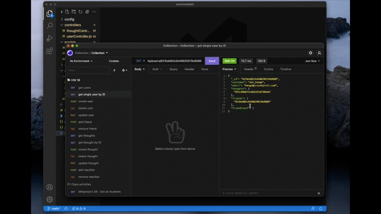

### About Social Media DB

Table of Contents

  <ol>
    <li><a href="#description">Description</a></li>
    <li><a href="#built-with">Built With</a></li>
    <li><a href="#installation">Installation</a></li>
    <li><a href="#usage">Usage</a></li>
    <li><a href="#future-updates">Future Updates</a></li>
  </ol>

## Description

This API uses a server to store users, thoughts, and reactions similar to a social media platform. Click on the image to watch my demo of this app. 

## Built With

This was built with the MongoDB, Mongoose, Express, and JavaScript. 

## Installation

MongoDB installation is required. An API like Insomnia or Postman is beneficial for executing this routes. Clone the repo onto your local machine. Open the root folder in terminal or git bash. Execute the command `npm i` to install the required node modules. To seed the data, you will have to create users, thoughts, and reactions using the get requests and the respective routes as seen in the demo video.

## Usage

Run the command `npm run start` or `node index.js` to start the server. Open Insomnia or Postman. Create routes as seen in the video to utilize CRUD functionality for this database.

## Future Updates

Validate that the username and userId match when posting thoughts or reactions. Delete any associated thoughts or reactions when users are deleted.
